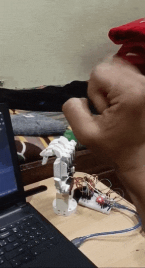

# MrPalm

Just something me and my friend were working on.

This project is heavily inspired from [[1]](#1). All the 3d printed models are also inspired from this paper resource and modified for the servo placement.

## References
<a id="1">[1]</a>
Hyeonjun Park, Donghan Kim,
An open-source anthropomorphic robot hand system: HRI hand,
HardwareX,
Volume 7,
2020,
e00100,
ISSN 2468-0672,
https://doi.org/10.1016/j.ohx.2020.e00100.
